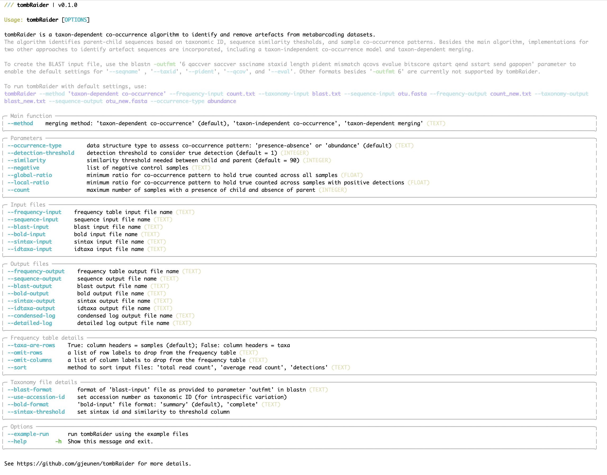
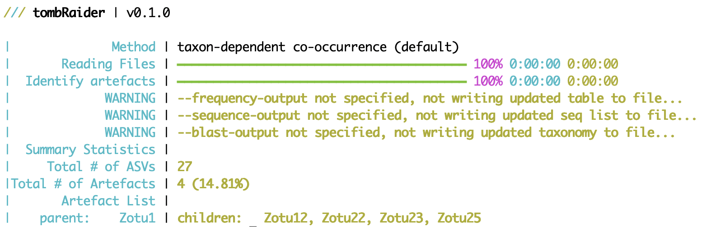
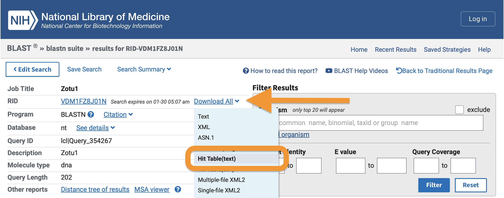

# *tombRaider* - an algorithm to identify artefacts from metabarcoding data

## 1. Introduction

Thank you for using *tombRaider*, an algorithm capable of identifying and removing artefact sequences from metabarcoding data sets.

## 2. Installation

*tombRaider* is a command-line only toolkit running on typical Unix/Linux environments and is exclusively written in Python3. *tombRaider* can be installed manually from GitHub. Below are details for the manual installation process ([2.1 Manual installation](#21-manual-installation)). Due to the native implementation of the incorporated functions, only a limited number of dependencies restricted to non-built-in Python3 modules are required for *tombRaider* to successfully execute. A complete list of the dependencies can be found below (please see [2.2 Dependencies](#22-dependencies)). Remember to install the dependencies separately, since the GitHub installation of *tombRaider* will not install the dependencies for you!

### 2.1 Manual installation

To manually install *tombRaider*, download the files from GitHub using the `git clone` command in the Terminal.

```{code-block} bash
git clone https://github.com/gjeunen/tombRaider.git
```

Dependent on your OS settings, the downloaded files might need to be made executable, which can be achieved by running the `chmod +x tombRaider` command. You can make *tombRaider* globally accessible in your OS using the following command:

```{code-block} bash
export PATH="/path/to/tombRaider/folder:$PATH"
```

Substitute `/path/to/tombRaider/folder` with the actual path to the repo folder on your system. Adding this line to the `.bash_profile`, `.bashrc`, or `.zshrc` file in your home directory will keep *tombRaider* globally accessible, even when closing the Terminal application.

### 2.2 Dependencies

Once the GitHub files are downloaded, ensure the following Python3 modules with the correct or compatible versions are accessible to *tombRaider*:

1. [Python3](https://www.python.org/downloads/) (*v 3.11.5*)
2. [rich](https://rich.readthedocs.io/en/stable/introduction.html) (*v 13.3.5*)
3. [rich-click](https://github.com/ewels/rich-click) (*v 1.6.1*)
4. [numpy](https://numpy.org) (*v 1.25.2*)
5. [pandas](https://pandas.pydata.org/docs/getting_started/install.html) (*v 2.1.4*)

### 2.3 Check the installation

To check if the installation was successful, type the following command into the Terminal to prompt the help information:

```{code-block} bash
tombRaider -h
```



Additionally, you can run *tombRaider* on the example files in the `exampleFiles` subdirectory by executing:

```{code-block} bash
tombRaider --example-run
```

The code above equates to running the following line of code:

```{code-block} bash
tombRaider --method 'taxon-dependent co-occurrence' --frequency-input 'zotutabweb.txt' --blast-input 'blastTaxonomy.txt' --sequence-input 'zotus.fasta' --occurrence-type abundance --count 0 --sort 'total read count'
```

*tombRaider* will figure out the absolute path of the necessary files based on where *tombRaider* is installed on your OS to run this command. The output of the command should be as follows:



## 3. Code execution

With *tombRaider* only a single line of code is required to identify and remove artefacts from your metabarcoding data!

To run *tombRaider* with default values, use the following line of code:

```{code-block} bash
tombRaider --method 'taxon-dependent co-occurrence' --frequency-input countTable.txt --sequence-input sequences.fasta --blast-input blastnResults.txt --frequency-output countTableNew.txt --sequence-output sequencesNew.fasta --blast-output blastnResultsNew.txt --condensed-log condensedLog.txt --detailed-log detailedLog.txt --count 0 --sort 'total read count'
```

Detailed information about all input file structures ([4. Input and output files](#4-input-and-output-files)) and parameters ([5. Parameters](#5-parameters)) can be found below.

## 4. Input and output files

An example of all input files can be found in the `exampleFiles` subdirectory on GitHub or where *tombRaider* is installed on your OS. This file list can help determine the file structures required by *tombRaider* when formatting errors are preventing a successful execution on your local files.

### 4.1 Count table

The count table, also known as frequency table, OTU table, or ASV table, should be a tab-delimited file whereby the taxa are represented in rows and samples in columns. The first row of the file is treated as the column headers (sample list), while the first column is treated as row names (sequence or OTU names). The count table can be read in through the `--frequency-input` parameter and is required for *tombRaider* to successfully execute. If your count table is oriented in the opposite orientation, i.e., samples as rows and taxa as columns, the `--taxa-are-rows` parameter should be set to `'False'`. If your count table is oriented in the correct direction, you can omit the `--taxa-are-rows` parameter, as it will default to `'True'`.

For *tombRaider* to execute successfully, the count table should not contain any metadata rows or columns. Frequently-occurring metadata columns in a count table could, for instance, be the taxonomic ID for a sequence or the actual sequence of the OTU. If any metadata columns or rows are present in your count table, you can provide the column header(s) and/or row name(s) using the `--omit-columns` and `--omit-rows` parameters, respectively. Multiple labels can be provided to the parameters using the `,` delimiter. Do not use spaces after the `,` delimiter!

Please note that columns and headers will be removed prior to transposing the table when `--taxa-are-rows` is set to `'False'`. So, if your count table is oriented whereby the taxa are columns and one of the rows contains the taxonomic ID with label "taxID" and another row contains the sequence with label "sequence", use the following line of code:

```{code-block} bash
tombRaider --frequency-input countTable.txt --taxa-are-rows False --omit-rows 'taxID,sequence' ...
```

An updated count table, whereby child sequences are merged with parent sequences, can be written to an output file using the `--frequency-output` parameter. If the `--frequency-output` parameter is not provided, the following warning message will be printed in bold yellow in the Terminal window by *tombRaider*:

```{note}
WARNING | --frequency-output not specified, not writing updated table to file...
```

### 4.2 Sequence list

The sequence file should be in the format of a .fasta file, either as a 2-line or multi line structure. The sequence file can be provided with the `--sequence-input` parameter and is required for *tombRaider* to successfully execute. An updated sequence file, whereby artefacts are removed, can be written to an output file using the `--sequence-output` paramter. If the `--sequence-output` parameter is not provided, the following warning message will be printed in bold yellow in the Terminal window by *tombRaider*:

```{note}
WARNING | --sequence-output not specified, not writing updated seq list to file...
```

### 4.3 Taxonomy assignment

*tombRaider* currently supports 4 taxonomy classification methods for optimal flexibility of a user's bioinformatic pipeline, including BLAST, BOLD, SINTAX, and IDTAXA. The taxonomy input file is essential when specifying the `taxon-dependent co-occurrence` and `taxon-dependent merging` options for the `--method` parameter (please find more info in [5.1 Main algorithm](#51-main-algorithm)). When specifying `--method taxon-independent co-occurrence`, no taxonomy input file is needed for *tombRaider* to execute. However, a taxonomy input and output file can still be provided in this case, which will subset the taxonomy file and remove the artefacts in the specified output file. This functionality is included to ensure all documents are updated and allow for easy import in other software packages without errors, such as [phyloseq](https://joey711.github.io/phyloseq/).

Please find below more detailed information about each of the 4 taxonomy classification format requirements for *tombRaider*.

If you have any other taxonomy classification method you would like to see incorporated into *tombRaider*, please let us know and we'll include it in the next major update.

#### 4.3.1 BLAST

BLAST is the most commonly-used method for taxonomy assignment in eukaryote metabarcoding research and can be conducted online or via the command-line interface. *tombRaider* can read in BLAST results using the `--blast-input` parameter and output the updated BLAST results, with artefacts removed, using the `--blast-output` parameter. Currently, *tombRaider* only supports the tabular output format 6. This format can be retrieved from your BLAST search through the website by selecting the "Hit Table(text)" option for downloading. Please see the screenshot below for additional info.



When executing BLAST via the CLI, the following code will ensure the proper format is selected for *tombRaider*:

```{code-block} bash
blastn -query sequences.fasta -outfmt 6
```

The *tombRaider* algorithm requires the following fields to be present in the BLAST file:

- qaccver: query sequence id
- qcovs: query coverage
- pident: percent identity match
- saccver: subject accession version
- evalue: expected value
- length: alignment length
- gapopen: number of gap openings
- mismatch: number of mismatches

Use the `--blast-format` parameter to tell *tombRaider* where these fields are located within your BLAST file. The `--blast-format` parameter takes in the string provided to `blastn -outfmt` when you executed BLAST via the CLI. When downloading BLAST results from the website, this metadata is provided in the first few lines of the downloaded document (line starting with `#`). When running blastn via the CLI, we recommend using the following line of code to enable the default option for `--blast-format`:

```{code-block} bash
blastn -query sequences.fasta -outfmt '6 qaccver saccver ssciname staxid length pident mismatch qcovs evalue bitscore qstart qend sstart send gapopen' -max_target_seqs 100 -perc_identity 50 -qcov_hsp_perc 50 -out blastTaxonomy.txt
```

##### 4.3.1.1 Intra-specific variation

When the genetic marker holds information on intra-specific variation (haplotypes) and the aim of the study is to investigate this intra-specific variation within various species, the taxonomic ID used by *tombRaider* should be set to the subject accession version ('saccver'). To accomplish this, provide the `--use-accession-id` parameter. No arguments are necessary for this parameter. Please find an example line of code below:

```{code-block} bash
tombRaider --method 'taxon-dependent co-occurrence' --frequency-input countTable.txt --sequence-input sequences.fasta --blast-input blastnResults.txt --frequency-output countTableNew.txt --sequence-output sequencesNew.fasta --blast-output blastnResultsNew.txt --condensed-log condensedLog.txt --detailed-log detailedLog.txt --count 0 --sort 'total read count' --use-accession-id
```

Please note that this option to investigate intra-specific variation is only available for BLAST!

#### 4.3.2 BOLD

TBA

#### 4.3.3 SINTAX

The SINTAX algorithm predicts the taxonomy of marker gene reads based on k-mer similarity and is implemented in [USEARCH](https://www.drive5.com/usearch/) and [VSEARCH](https://github.com/torognes/vsearch). When the SINTAX classification algorithm was used for taxonomy assignment during the bioinformatic pipeline, the input file can be provided using the `--sintax-input` parameter. To write the updated list with artefacts removed, use the `--sintax-output` parameter. The SINTAX reports should be in tab-delimited format, which is the default format for [USEARCH](https://www.drive5.com/usearch/) and [VSEARCH](https://github.com/torognes/vsearch). *tombRaider* defaults to using the SINTAX results without a threshold applied, i.e., the second column in the SINTAX report. Use the `--sintax-threshold` parameter without arguments for *tombRaider* to use the SINTAX results where the user-defined threshold has been applied, i.e., the fourth column in the SINTAX report.

#### 4.3.4 IDTAXA

TBA

### 4.4 Log files

Besides the summary report *tombRaider* prints to the Terminal window (please see an example summary report provided by *tombRaider* when running `tombRaider --example-run`), two different log files can be written to output files by *tombRaider*, including a condensed log file (`--condensed-log`) and a detailed log file (`--detailed-log`). Information about the structure of each log file can be found in [4.4.1 condensed log file](#441-condensed-log-file) and [4.4.2 detailed log file](#442-detailed-log-file).


#### 4.4.1 condensed log file

TBA

#### 4.4.2 detailed log file

TBA

## 5. Parameters

Please find below the details about all parameters incorporated into *tombRaider*. Parameters associated with input and output files can be found in [4. Input and output files](#4-input-and-output-files).

### 5.1 Main algorithm

#### 5.1.1 --method

*tombRaider* currently supports 3 algorithms to identify artefact sequences in metabarcoding data sets, including one novel approach and two widely-used methods in the metabarcoding research community. The algorithms can be specified using the `--method` parameter. The following three options are currently supported:

1. `--method 'taxon-dependent co-occurrence'`: This novel approach is the default setting in *tombRaider* and allows for the most accurate species and haplotype recovery from metabarcoding data sets. Artefacts are identified based on taxonomic classification, sequence similarity, and co-occurrence patterns. For more information about the optional parameters, please see [5.2 Parameters](#52-parameters). This algorithm is currently the only automated method to recover haplotypes from metabarcoding data sets.
2. `--method 'taxon-independent co-occurrence'`: This approach identifies artefacts based on sequence similarity and co-occurrence patterns. It was pioneered by [Froslev et al., 2017](https://github.com/tobiasgf/lulu) and has since seen alteration and optimisation in a variety of settings, e.g., [mumu](https://github.com/frederic-mahe/mumu).
3. `--method 'taxon-dependent merging'`: This approach merges sequences based on taxonomic ID and is a widely-used approach in the metabarcoding research community.

### 5.2 Parameters

#### 5.2.1 --occurrence-type

The parameter `--occurrence-type` enables users to specify if the co-occurrence pattern between parent and child sequences should be based on read abundance (`--occurrence-type abundance`) or presence-absence (`--occurrence-type 'presence-absence'`), with the default set to `--occurrence-type abundance`.

When `--occurrence-type abundance` is selected, for the co-occurrence pattern to hold true, the parent will need to achieve a higher read abundance than the child. The user can specify a threshold for how frequently this statement can be violated before the co-occurrence pattern does not hold true anymore (please see [5.2.5 count, --global-ratio, --local-ratio](#525---count---global-ratio---local-ratio)). Since artefacts originate during PCR amplification, it is expected that child sequences can only occur when the parent is detected in the sample and are less abundant than the parent. Hence, the default for `--occurrence-type` within *tombRaider* is set to `abundance`. However, this expectation that child sequences are less abundant than their parent in metabarcoding data may not always hold true, due to reduced amplification efficiency for metabarcoding primers, multiple sample handling steps after PCR amplification, and biases in Illumina sequencing technology. Therefore, *tombRaider* allows the user to specify the data should be treated as presence-absence instead. It should be noted that the frequency this expectation of the parent being more abundant than the child not holding true is not empirically tested.

When `--occurrence-type 'presence-absence'` is selected, for the co-occurrence pattern to hold true, the parent will need to have a positive detection when the child is present. Similarly to the `abundance` option, the user can specify a threshold for how frequently this statement can be violated before the co-occurrence pattern does not hold true anymore (please see [5.2.5 count, --global-ratio, --local-ratio](#525---count---global-ratio---local-ratio)).

To illustrate the difference between `--occurrence-type abundance` and `--occurrence-type 'presence-absence'`, let's look at the following example where we have the read abundance for two sequences in five samples.

| OTU ID | Sample 1 | Sample 2 | Sample 3 | Sample 4 | Sample 5 |
| --- | --- | --- | --- | --- | --- |
| Seq 1 | 100 | 500 | 400 | 200 | 100 |
| Seq 2 | 50 | 200 | 200 | 0 | 500 |

In our example, `Seq 2` is being analysed as a child of `Seq 1` based on the co-occurrence pattern (please see [5.2.6 --sort](#526---sort) on why `Seq 2` is being analysed as the child, rather than `Seq 1`). With the following line of code:

```{code-block} bash
tombRaider --occurrence-type abundance ...
```

`Seq 2` is rejected as a child of `Seq 1`, since `Seq 2` has a higher read abundance than `Seq 1` in `Sample 5`, 500 reads compared to 100 reads. However, with the following line of code:

```{code-block} bash
tombRaider --occurrence-type 'presence-absence' ...
```

`Seq 2` is accepted as a child of `Seq 1` (assuming the taxonomic ID and sequence similarity thresholds are met), since `Seq 2` is only present in samples when `Seq 1` is detected.

#### 5.2.2 --detection-threshold

With the `--detection-threshold` parameter, users can define the minimum read abundance needed for a detection to hold true.

Metabarcoding data sets can contain so-called "background noise" originating from a variety of sources, e.g., tag-jumping (please see [Schnell et al., 2015](https://onlinelibrary.wiley.com/doi/10.1111/1755-0998.12402) and [Rodriguez-Martinez et al., 2022](https://onlinelibrary.wiley.com/doi/full/10.1111/1755-0998.13745) for more information) or incorrect assigned sequences during demultiplexing. Low-abundant detections, such as singleton detections, are therefore frequently removed from metabarcoding data sets prior to statistical analysis.

When analysing the co-occurrence pattern of parent-child sequences, this "background noise" can be removed using the `--detection-threshold` parameter. The default value for this parameter is set to `1`, indicating singleton detections to be included in the analysis. To exclude singleton detections, this value should be set to `2`. Higher values can be specified as well to remove low-abundant detections from the co-occurrence pattern analysis. Please note that while low-abundant detections can be removed from the co-occurrence pattern analysis using the `--detection-threshold` parameter, these low-abundant detections will not be removed from the final count table written to the output file using the `--frequency-output` parameter!

Let's look at the following example to show how the `--detection-threshold` parameter functions. Assume the table below to be our count table input file.

| OTU ID | Sample 1 | Sample 2 | Sample 3 | Sample 4 | Sample 5 |
| --- | --- | --- | --- | --- | --- |
| Seq 1 | 0 | 500 | 400 | 200 | 100 |
| Seq 2 | 1 | 200 | 200 | 0 | 2 |

In our example, `Seq 2` is being analysed as a child of `Seq 1`. With the following default values:

```{code-block} bash
tombRaider --occurrence-type abundance --detection-threshold 1 ...
```

`Seq 2` is rejected as the child of `Seq 1`, since the co-occurrence pattern does not hold true. `Seq 2` is present in `Sample 1`, while `Seq 1` is not detected in `Sample 1`. However, when removing singleton detections from the count table by specifying `--detection-threshold 2`:

```{code-block} bash
tombRaider --occurrence-type abundance --detection-threshold 2 ...
```

`Seq 2` is accepted as the child of `Seq 1` (assuming the taxonomic ID and sequence similarity thresholds are met), since the read count of `Seq 2` in `Sample 1` is now set to `0`. While singleton detections are removed from the co-occurrence pattern analysis, the output file contains all original reads. Hence, the resulting table will look like:

| OTU ID | Sample 1 | Sample 2 | Sample 3 | Sample 4 | Sample 5 |
| --- | --- | --- | --- | --- | --- |
| Seq 1 | 1 | 700 | 600 | 200 | 102 |

#### 5.2.3 --similarity

The `--similarity` parameter specifies the sequence similarity threshold required between the child and parent sequence. The default for this parameter is set at 90, indicating the child needs to be at least 90% similar to the parent. The sequence similarity between parent and child is calculated from a global pairwise sequence alignment. The alignment algorithm implemented in *tombRaider* is the Needleman-Wunsch algorithm ([Needleman & Wunsch, 1970](https://www.sciencedirect.com/science/article/pii/0022283670900574?via%3Dihub)). The algorithm is natively coded in Python3 through dynamic programming for increased accurracy and speed, while also limiting the required number of dependencies for *tombRaider*. Once the global pairwise alignment has been generated, the sequence similarity is calculated by the following equation: 100 - (# of differences / alignment length * 100)

#### 5.2.4 --negative

If users wish to do so, negative controls can be omitted from the co-occurrence pattern analysis by specifying the sample names using the `--negative` parameter. Multiple sample names can be provided by using the `+` delimiter. Negative samples can also be identified through pattern searches by adding `*` before and/or after the substring. For example, `NEG*` will remove all sample names starting with `NEG`, while `*NEG` will remove all sample names ending with `NEG`, and `*NEG*` will remove all sample names containing `NEG`. Multiple pattern searches can be combined as follows:

```{code-block} bash
tombRaider --negative 'ctrBlank+*NEG+Blk*+*Ext*' ...
```

The argument passed to `--negative` in the example above will remove the sample `ctrBlank`, as well as all samples ending in `NEG`, all samples starting with `Blk`, and all samples containing `Ext` from the co-occurrence pattern analysis. Please note that the specified samples will not be removed in the final count table written to the output file using the `--frequency-output` parameter!

Let's look at the following example as an illustration for the functionality of `--negative`. Assume the table below to be our count table input file.

| OTU ID | Sample 1 | Sample 2 | Sample 3 | Sample 4 | Sample 5 | NEG 1 |
| --- | --- | --- | --- | --- | --- | --- |
| Seq 1 | 100 | 500 | 400 | 200 | 100 | 0 |
| Seq 2 | 50 | 200 | 200 | 0 | 2 | 5 |

In our example, `Seq 2` is being analysed as a child of `Seq 1`. With the following default values:

```{code-block} bash
tombRaider --occurrence-type abundance ...
```

`Seq 2` is rejected as the child of `Seq 1`, since the co-occurrence pattern does not hold true. `Seq 2` is present in `NEG 1`, while `Seq 1` is not detected in `NEG 1`. However, when removing negative controls from the co-occurrence pattern analysis by specifying `--negative 'NEG*'`:

```{code-block} bash
tombRaider --occurrence-type abundance --negative 'NEG*' ...
```

`Seq 2` is accepted as the child of `Seq 1` (assuming the taxonomic ID and sequence similarity thresholds are met), since the `NEG 1` column is now omitted from the co-occurence pattern analysis. While the `NEG 1` column is removed from the co-occurrence pattern analysis, the output file contains all original reads. Hence, the resulting table will look like:

| OTU ID | Sample 1 | Sample 2 | Sample 3 | Sample 4 | Sample 5 | NEG 1 |
| --- | --- | --- | --- | --- | --- | --- |
| Seq 1 | 150 | 700 | 600 | 200 | 102 | 5 |

#### 5.2.5 --count, --global-ratio, --local-ratio

For *tombRaider* to identify artefacts in metabarcoding data sets, the co-occurrence pattern between child and parent must hold true for all samples with `--method 'taxon-dependent co-occurrence'` and `--method 'taxon-independent co-occurrence'`, whereby a child sequence can only be observed when a parent is present (`--occurrence-type 'presence-absence'`) or a child sequence needs to have assigned fewer reads than the parent (`--occurrence-type abundance`).

Users, however, can specify the frequency for which the co-occurrence pattern does not have to hold true, while still identifying a parent-child combo. Users can specify this frequency using 1 of three parameters.

##### 5.2.5.1 --count

The first parameter users can specify the frequency for which the co-occurrence pattern has to hold true is the `--count` parameter. The `--count` parameter specifies the number of times a child can be observed without the presence of a parent (`--occurrence-type 'presence-absence'`) or observed to have a higher read count than a parent (`--occurrence-type abundance`). Let's look at the following example to illustrate the functionality of `--count`. Assume the table below to be our count table input file.

| OTU ID | Sample 1 | Sample 2 | Sample 3 | Sample 4 | Sample 5 |
| --- | --- | --- | --- | --- | --- |
| Seq 1 | 0 | 0 | 400 | 200 | 100 |
| Seq 2 | 100 | 0 | 200 | 0 | 2 |

When specifying `--count 0`, the co-occurrence pattern must hold true for all samples.

```{code-block} bash
tombRaider --occurrence-type abundance --count 0 ...
```

Therefore, `Seq 2` is rejected as a child of `Seq 1`, since `Seq 2` is observed to have 100 reads assigned to `Sample 1`, while `Seq 1` is not detected in `Sample 1`. However, when `--count` is set to `1`:

```{code-block} bash
tombRaider --occurrence-type abundance --count 1 ...
```

`Seq 2` is accepted as a child of `Seq 1` (assuming the taxonomic ID and sequence similarity thresholds are met), since the co-occurrence pattern holds true for all samples, except for the single sample `Sample 1`.

##### 5.2.5.2 --global-ratio

The second parameter users can specify the frequency for which the co-occurrence pattern has to hold true is the `--global-ratio` parameter. The `--global-ratio` parameter specifies the ratio whereby the child can be observed without the presence of a parent (`--occurrence-type 'presence-absence'`) or observed to have a higher read count than a parent (`--occurrence-type abundance`) divided by the total number of samples in the count table.

Let's look at the following example to illustrate the functionality of `--global-ratio`. Assume the table below to be our count table input file.

| OTU ID | Sample 1 | Sample 2 | Sample 3 | Sample 4 | Sample 5 |
| --- | --- | --- | --- | --- | --- |
| Seq 1 | 0 | 0 | 400 | 200 | 100 |
| Seq 2 | 100 | 0 | 200 | 0 | 2 |

When specifying `--global-ratio 1`, the co-occurrence pattern must hold true for all samples.

```{code-block} bash
tombRaider --occurrence-type abundance --global-ratio 1 ...
```

Therefore, `Seq 2` is rejected as a child of `Seq 1`, since `Seq 2` is observed to have 100 reads assigned to `Sample 1`, while `Seq 1` is not detected in `Sample 1`. However, when `--global-ratio` is set to `0.8`:

```{code-block} bash
tombRaider --occurrence-type abundance --global-ratio 0.8 ...
```

`Seq 2` is accepted as a child of `Seq 1` (assuming the taxonomic ID and sequence similarity thresholds are met), since the co-occurrence pattern holds true for 4 out of 5 samples (= 80%).

##### 5.2.5.3 --local-ratio

The third, and final, parameter users can specify the frequency for which the co-occurrence pattern has to hold true is the `--local-ratio` parameter. The `--local-ratio` parameter specifies the ratio whereby the child can be observed without the presence of a parent (`--occurrence-type 'presence-absence'`) or observed to have a higher read count than a parent (`--occurrence-type abundance`) divided by the total number of samples with a positive detection in child + parent.

Let's look at the following example to illustrate the functionality of `--local-ratio`. Assume the table below to be our count table input file.

| OTU ID | Sample 1 | Sample 2 | Sample 3 | Sample 4 | Sample 5 |
| --- | --- | --- | --- | --- | --- |
| Seq 1 | 0 | 0 | 400 | 200 | 100 |
| Seq 2 | 100 | 0 | 200 | 0 | 2 |

When specifying `--local-ratio 1`, the co-occurrence pattern must hold true for all samples.

```{code-block} bash
tombRaider --occurrence-type abundance --local-ratio 1 ...
```

Therefore, `Seq 2` is rejected as a child of `Seq 1`, since `Seq 2` is observed to have 100 reads assigned to `Sample 1`, while `Seq 1` is not detected in `Sample 1`. However, when `--local-ratio` is set to `0.75`:

```{code-block} bash
tombRaider --occurrence-type abundance --local-ratio 0.75 ...
```

`Seq 2` is accepted as a child of `Seq 1` (assuming the taxonomic ID and sequence similarity thresholds are met), since the co-occurrence pattern holds true for 3 out of 4 samples with a positive detection of either the child or parent (= 75%).

#### 5.2.6 --sort

For *tombRaider* to identify artefact sequences in metabarcoding data, the count table is sorted and all lower-rank sequences are compared to higher-rank sequences to determine if the lower-rank sequence is an artefact of the higher-rank sequence. *tombRaider* supports 3 ways to sort the count table using the `--sort` parameter, including `'total read count'`, `'average read count'`, and `'detections'`. Please find an example below of each of the three sorting methods.

##### 5.2.6.1 --sort 'total read count'

To sort the count table on total read count, reads from all samples for each sequence are summed and sorted in decreasing order. For example, the following input count table:

| OTU ID | Sample 1 | Sample 2 | Sample 3 | Sample 4 | Sample 5 |
| --- | --- | --- | --- | --- | --- |
| Seq 1 | 0 | 0 | 400 | 200 | 100 |
| Seq 2 | 100 | 0 | 200 | 0 | 2 |
| Seq 3 | 100 | 10 | 500 | 0 | 20 |
| Seq 4 | 500 | 600 | 200 | 0 | 0 |

Will be transformed to:

 OTU ID | Sample 1 | Sample 2 | Sample 3 | Sample 4 | Sample 5 |
| --- | --- | --- | --- | --- | --- |
| Seq 4 | 500 | 600 | 200 | 0 | 0 |
| Seq 1 | 0 | 0 | 400 | 200 | 100 |
| Seq 3 | 100 | 10 | 500 | 0 | 20 |
| Seq 2 | 100 | 0 | 200 | 0 | 2 |

Since, the total read count for `Seq 4` is 1,300, `Seq 1` is 700, `Seq 3` is 630, and `Seq 2` is 302.

##### 5.2.6.2 --sort 'average read count'

To sort the count table on average read count, reads from all samples for each sequence are summed and divided by the number of samples with a positive detection. Finally, they are sorted in decreasing order. For example, the following input count table:

| OTU ID | Sample 1 | Sample 2 | Sample 3 | Sample 4 | Sample 5 |
| --- | --- | --- | --- | --- | --- |
| Seq 1 | 0 | 0 | 400 | 200 | 100 |
| Seq 2 | 100 | 0 | 200 | 0 | 2 |
| Seq 3 | 100 | 10 | 500 | 0 | 20 |
| Seq 4 | 500 | 600 | 200 | 0 | 0 |

Will be transformed to:

 OTU ID | Sample 1 | Sample 2 | Sample 3 | Sample 4 | Sample 5 |
| --- | --- | --- | --- | --- | --- |
| Seq 4 | 500 | 600 | 200 | 0 | 0 |
| Seq 1 | 0 | 0 | 400 | 200 | 100 |
| Seq 3 | 100 | 10 | 500 | 0 | 20 |
| Seq 2 | 100 | 0 | 200 | 0 | 2 |

Since, the average read count for `Seq 4` is 433.33, `Seq 1` is 233.33, `Seq 3` is 157.5, and `Seq 2` is 100.67.

##### 5.2.6.3 --sort 'detections'

To sort the count table on detections, sequences are sorted by the number of samples with a positive detection. For example, the following input count table:

| OTU ID | Sample 1 | Sample 2 | Sample 3 | Sample 4 | Sample 5 |
| --- | --- | --- | --- | --- | --- |
| Seq 1 | 0 | 0 | 400 | 200 | 100 |
| Seq 2 | 100 | 0 | 200 | 0 | 2 |
| Seq 3 | 100 | 10 | 500 | 0 | 20 |
| Seq 4 | 500 | 600 | 200 | 0 | 0 |

Will be transformed to:

 OTU ID | Sample 1 | Sample 2 | Sample 3 | Sample 4 | Sample 5 |
| --- | --- | --- | --- | --- | --- |
| Seq 3 | 100 | 10 | 500 | 0 | 20 |
| Seq 4 | 500 | 600 | 200 | 0 | 0 |
| Seq 1 | 0 | 0 | 400 | 200 | 100 |
| Seq 2 | 100 | 0 | 200 | 0 | 2 |

Since, the average read count for `Seq 3`, `Seq 4`, `Seq 1`, and `Seq 2`. The order of `Seq 4`, `Seq 1`, and `Seq 2` is determined on total read count.
