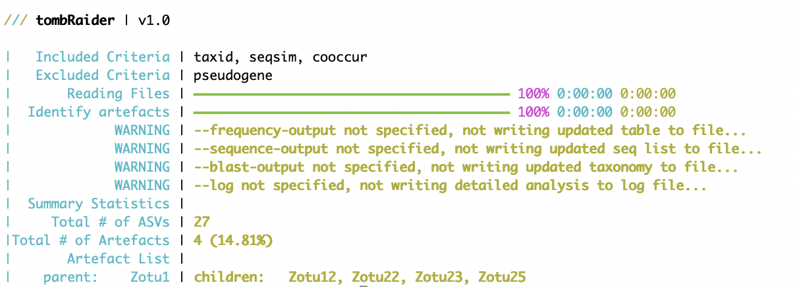

# *tombRaider* - an algorithm to identify artefacts from metabarcoding data

## 1. Introduction

Thank you for using *tombRaider*, an algorithm capable of identifying and removing artefact sequences from metabarcoding data sets.

## 2. Installation

*tombRaider* is a command-line only toolkit running on typical Unix/Linux environments and is exclusively written in Python3. *tombRaider* can be installed manually from GitHub. Below are details for the manual installation process ([2.1 Manual installation](#21-manual-installation)). Due to the native implementation of the incorporated functions, only a limited number of dependencies restricted to non-built-in Python3 modules are required for *tombRaider* to successfully execute. A complete list of the dependencies can be found below (please see [2.2 Dependencies](#22-dependencies)). Remember to install the dependencies separately, since the GitHub installation of *tombRaider* will not install the dependencies for you!

Besides this Python3 version, *tombRaider* is also available as an R package. Please find the installation instructions and further information on the functionality of the R package on the GitHub repository: <https://github.com/gjeunen/tombRaider_R>.

### 2.1 Manual installation

To manually install *tombRaider*, download the files from GitHub using the `git clone` command in the Terminal.

```{code-block} bash
git clone https://github.com/gjeunen/tombRaider.git
```

Dependent on your OS settings, the downloaded files might need to be made executable, which can be achieved by running the `chmod +x tombRaider` command. You can make *tombRaider* globally accessible in your OS using the following command:

```{code-block} bash
export PATH="/path/to/tombRaider/folder:$PATH"
```

Substitute `/path/to/tombRaider/folder` with the actual path to the repo folder on your system. Adding this line to the `.bash_profile`, `.bashrc`, or `.zshrc` file in your home directory will keep *tombRaider* globally accessible, even when closing the Terminal application.

### 2.2 Dependencies

Once the GitHub files are downloaded, ensure the following Python3 modules with the correct or compatible versions are accessible to *tombRaider*:

1. [Python3](https://www.python.org/downloads/) (*v 3.11.5*)
2. [rich](https://rich.readthedocs.io/en/stable/introduction.html) (*v 13.3.5*)
3. [rich-click](https://github.com/ewels/rich-click) (*v 1.6.1*)
4. [numpy](https://numpy.org) (*v 1.25.2*)
5. [pandas](https://pandas.pydata.org/docs/getting_started/install.html) (*v 2.1.4*)

### 2.3 Check the installation

To check if the installation was successful, type the following command into the Terminal to prompt the help information:

```{code-block} bash
tombRaider -h
```


Additionally, you can run *tombRaider* on the example files in the `exampleFiles` subdirectory by executing:

```{code-block} bash
tombRaider --example-run
```

The code above equates to running the following line of code:

```{code-block} bash
tombRaider --criteria 'taxId;seqSim;coOccur' --frequency-input 'zotutabweb.txt' --taxonomy-input 'blastTaxonomy.txt' --sequence-input 'zotus.fasta' --occurrence-type abundance --occurrence-ratio 'count;0' --sort 'total read count' --blast-format '6 qaccver saccver ssciname staxid length pident mismatch qcovs evalue bitscore qstart qend sstart send gapopen' --taxon-quality --similarity 90
```

*tombRaider* will figure out the absolute path of the necessary files based on where *tombRaider* is installed on your OS to run this command. The output of the command should be as follows:



## 3. Code execution

With *tombRaider* only a single line of code is required to identify and remove artefacts from your metabarcoding data!

To run *tombRaider* with default values, use the following line of code:

```{code-block} bash
tombRaider --criteria 'taxId;seqSim;coOccur' --frequency-input countTable.txt --sequence-input sequences.fasta --taxonomy-input blastnResults.txt --blast-format '6 qaccver saccver ssciname staxid length pident mismatch qcovs evalue bitscore qstart qend sstart send gapopen' --frequency-output countTableNew.txt --sequence-output sequencesNew.fasta --taxonomy-output blastnResultsNew.txt --log log.txt --occurrence-type abundance --occurrence-ratio 'count;0' --sort 'total read count' --similarity 90
```

Detailed information about all input file structures ([4. Input and output files](#4-input-and-output-files)) and parameters ([5. Parameters](#5-parameters)) can be found below.

## 4. Input and output files

An example of all input files can be found in the `exampleFiles` subdirectory on GitHub or where *tombRaider* is installed on your OS. This file list can help determine the file structures required by *tombRaider* when formatting errors are preventing a successful execution on your local files.

### 4.1 Count table

The count table, also known as frequency table, OTU table, or ASV table, should be a tab-delimited file whereby the taxa are represented in rows and samples in columns. The first row of the file is treated as the column headers (sample list), while the first column is treated as row names (sequence or OTU names). The count table can be read in through the `--frequency-input` parameter and is required for *tombRaider* to successfully execute. If your count table is oriented in the opposite orientation, i.e., samples as rows and taxa as columns, the `--transpose` parameter should be specified. If your count table is oriented in the correct direction, you can omit the `--transpose` parameter.

For *tombRaider* to execute successfully, the count table should not contain any metadata rows or columns. Frequently-occurring metadata columns in a count table could, for instance, be the taxonomic ID for a sequence or the actual sequence of the OTU. If any metadata columns or rows are present in your count table, you can provide the column header(s) and/or row name(s) using the `--omit-columns` and `--omit-rows` parameters, respectively. Multiple labels can be provided to the parameters using the `,` delimiter. Do not use spaces after the `,` delimiter!

Please note that columns and headers will be removed prior to transposing the table when `--transpose` is specified. So, if your count table is oriented whereby the taxa are columns and one of the rows contains the taxonomic ID with label "taxID" and another row contains the sequence with label "sequence", use the following line of code:

```{code-block} bash
tombRaider --frequency-input countTable.txt --transpose --omit-rows 'taxID,sequence' ...
```

An updated count table, whereby artefacts are removed, can be written to an output file using the `--frequency-output` parameter. If the `--frequency-output` parameter is not provided, the following warning message will be printed in bold yellow in the Terminal window by *tombRaider*:

```{note}
WARNING | --frequency-output not specified, not writing updated table to file...
```

### 4.2 Sequence list

The sequence file should be in the format of a .fasta file, either as a 2-line or multi line structure. The sequence file can be provided with the `--sequence-input` parameter and is required for *tombRaider* to successfully execute. An updated sequence file, whereby artefacts are removed, can be written to an output file using the `--sequence-output` paramter. If the `--sequence-output` parameter is not provided, the following warning message will be printed in bold yellow in the Terminal window by *tombRaider*:

```{note}
WARNING | --sequence-output not specified, not writing updated seq list to file...
```

### 4.3 Taxonomy assignment

*tombRaider* currently supports 4 taxonomy classification methods for optimal flexibility of a user's bioinformatic pipeline, including BLAST, BOLD, SINTAX, and IDTAXA. The taxonomy input file is essential when specifying `--criteria 'taxID'` (please find more info about this parameter in section [5.1 Main algorithm](#51-general-information)). When this criterium is not selected, no taxonomy input file is needed for *tombRaider* to execute. However, a taxonomy input and output file can still be provided in this case, which will subset the taxonomy file and remove the artefacts in the specified output file. This functionality is included to ensure all documents are updated and allow for easy import in other software packages without errors, such as [phyloseq](https://joey711.github.io/phyloseq/).

The taxonomy file can be read in using the `--taxonomy-input` parameter. An updated taxonomy file, whereby artefacts are removed, can be written to an output file using the `--taxonomy-output` parameter. If the `--taxonomy-output` parameter is not provided, the following warning message will be printed in bold yellow in the Terminal window by *tombRaider*:

```{note}
WARNING | --taxonomy-output not specified, not writing updated taxonomy to file...
```

*tombRaider* automatically identifies the format of the document and assigns it to one of the 4 supported taxonomy classification methods. Please find below more detailed information about each of the 4 taxonomy classification format requirements for *tombRaider*.

If you have any other taxonomy classification method you would like to see incorporated into *tombRaider*, please let us know and we'll include it in the next major update.

#### 4.3.1 BLAST

BLAST is the most commonly-used method for taxonomy assignment in eukaryote metabarcoding research and can be conducted online or via the command-line interface. Currently, *tombRaider* only supports the tabular output format 6. This format can be retrieved from your BLAST search through the website by selecting the "Hit Table(text)" option for downloading. Please see the screenshot below for additional info.


When executing BLAST via the CLI, the following code will ensure the proper format is selected for *tombRaider*:

```{code-block} bash
blastn -query sequences.fasta -outfmt 6
```

The *tombRaider* algorithm requires the following fields to be present in the BLAST file:

- qaccver: query sequence id
- qcovs: query coverage
- pident: percent identity match
- saccver: subject accession version
- evalue: expected value
- length: alignment length
- gapopen: number of gap openings
- mismatch: number of mismatches

Use the `--blast-format` parameter to tell *tombRaider* where these fields are located within your BLAST file. The `--blast-format` parameter takes in the string provided to `blastn -outfmt` when you executed BLAST via the CLI. When downloading BLAST results from the website, this metadata is provided in the first few lines of the downloaded document (line starting with `#`). When running blastn via the CLI, we recommend using the following line of code:

```{code-block} bash
blastn -query sequences.fasta -outfmt '6 qaccver saccver ssciname staxid length pident mismatch qcovs evalue bitscore qstart qend sstart send gapopen' -max_target_seqs 100 -perc_identity 50 -qcov_hsp_perc 50 -out blastTaxonomy.txt
```

##### 4.3.1.1 Intra-specific variation

When the genetic marker holds information on intra-specific variation (haplotypes) and the aim of the study is to investigate this intra-specific variation within various species, the taxonomic ID used by *tombRaider* should be set to the subject accession version ('saccver'). To accomplish this, provide the `--use-accession-id` parameter. No arguments are necessary for this parameter. Please find an example line of code below:

```{code-block} bash
tombRaider --criteria 'taxId;seqSim;coOccur' --frequency-input countTable.txt --sequence-input sequences.fasta --taxonomy-input blastnResults.txt --blast-format '6 qaccver saccver ssciname staxid length pident mismatch qcovs evalue bitscore qstart qend sstart send gapopen' --frequency-output countTableNew.txt --sequence-output sequencesNew.fasta --taxonomy-output blastnResultsNew.txt --log log.txt --occurrence-type abundance --occurrence-ratio 'count;0' --sort 'total read count' --similarity 90 --use-accession-id
```

Please note that this option to investigate intra-specific variation is only available for BLAST!

#### 4.3.2 BOLD

The BOLD IDentification Engine can be used to match query sequences to the [BOLD reference database](https://boldsystems.org) and is frequently used in metabarcoding research when the primers amplify the COI gene for animals, ITS gene for fungi, and RBCL & MATK genes for plants. *tombRaider* currently supports two output formats from the BOLD IDE, including the summary results and the complete report. The format can be specified using the `--bold-format` parameter.

##### 4.3.2.1 --bold-format summary

The BOLD IDE summary report can be obtained by clicking the Download button on the BOLD IDENTIFICATION ENGINE: RESULTS webpage. Please see the screenshot below for additional information. The downloaded file should be a .xls file. No additional changes should be made prior to importing the file into *tombRaider*!


##### 4.3.2.2 --bold-format complete

The complete BOLD IDE report can be obtained through [BOLDIGGER](https://github.com/DominikBuchner/BOLDigger), a python program developed and published in 2020 by [Buchner & Leese, 2020](https://mbmg.pensoft.net/article/53535/). For more information on obtaining the report from BOLDIGGER, please visit the [BOLDIGGER GitHub manual](https://github.com/DominikBuchner/BOLDigger). No additional changes should be made prior to importing the file into *tombRaider*!

#### 4.3.3 SINTAX

The SINTAX algorithm predicts the taxonomy of marker gene reads based on k-mer similarity and is implemented in [USEARCH](https://www.drive5.com/usearch/) and [VSEARCH](https://github.com/torognes/vsearch). The SINTAX reports should be in tab-delimited format, which is the default format for [USEARCH](https://www.drive5.com/usearch/) and [VSEARCH](https://github.com/torognes/vsearch). *tombRaider* defaults to using the SINTAX results without a threshold applied, i.e., the second column in the SINTAX report. Use the `--sintax-threshold` parameter without arguments for *tombRaider* to use the SINTAX results where the user-defined threshold has been applied, i.e., the fourth column in the SINTAX report.

#### 4.3.4 IDTAXA

The IDTAXA algorithm is implemented in the [DECIPHER R package](http://www2.decipher.codes/index.html), developed by Erik Wright, and published in [Murali et al., 2018](https://microbiomejournal.biomedcentral.com/articles/10.1186/s40168-018-0521-5). The IDTAXA algorithm employs a 2-step machine learning approach for taxonomy classification. Use the guide on the [DECIPHER website](http://www2.decipher.codes/Documentation/Documentation-ClassifySequences.html) to generate the output file. No additional changes should be made prior to importing the file into *tombRaider*!

### 4.4 Multiple Sequence Alignment

A multiple sequence alignment file can be optionally read in by *tombRaider* using the `--alignment-input` parameter. Providing a multiple sequence alignment file will circumvent *tombRaider* to generate pairwise sequence alignments to investigate sequence similarity when `--criteria 'seqSim'` is specified (please find more info about this parameter in section [5.1 Main algorithm](#51-general-information)), thereby significantly increasing the speed of code execution.

Please note that a multiple sequence alignment file is required when *tombRaider* needs to identify pseudogenes (`--criteria 'pseudogene`). If users specify `--criteria 'pseudogene'`, which requires a multiple sequence alignment input file, users can provide the `--calculate-pairwise` parameter for *tombRaider* to not use the multiple sequence alignment file to calculate pairwise sequence similarity, but instead use the built-in pairwise alignment algorithm.

Currently, only the nexus file format is supported for the multiple sequence alignment. If you have any other file format you would like to see incorporated into *tombRaider*, please let us know and we'll include it in the next major update.

### 4.5 Log file

Besides the summary report *tombRaider* prints to the Terminal window (please see an example summary report provided by *tombRaider* when running `tombRaider --example-run`), a log file can be written as output by *tombRaider* using the `--log` parameter.


The summary report printed to the Terminal window provides information about the incorporated critera to identify artefacts on the first line, progress bars and elapsed time during file inport and the identification of artefacts in the second and third lines. Potential warning messages are written below the progress bars when output files are not specified. Below the progress bars and potential warning messages are the summary statistics, including the total number of sequences analysed by *tombRaider*, the total number of artefacts identified with the proportion between brackets, followed by a list of each parent and identified children. The log output file contains further detailed information on why a sequence was deemed an artefact and can be generated for inclusion as a supplemental file in your manuscript to enable other research groups to recreate the obtained results prior to statistical analysis.

An example of the log file can be found below:


## 5. Parameters

Please find below the details about all parameters incorporated into *tombRaider*. The order of the parameters below follows the order in which parameters occur in the help documentation in the Terminal.

```{code-block} bash
tombRaider -h
```

### 5.1 General information

#### 5.1.1 --criteria

*tombRaider* is a modular algorithm to identify artefact sequences in metabarcoding data sets. *tombRaider* includes the support of various criteria to identify artefacts, which can be specified using the `--criteria` parameter. Criteria can be specified using a string. Multiple criteria can be combined, which provides a more effective manner of identifying artefacts in metabarcoding data sets. To specify multiple criteria, the criteria should be separated by `;` in the string. Currently, *tombRaider* supports 4 criteria to identify artefacts. Given the modular approach of the algorithm, future updates will include additional criteria based on novel findings in the scientific community. The following four criteria are currently supported:

1. `--criteria 'taxID'`: This criterium assesses if taxonomic ID's are identical between both OTUs/ASVs under investigation. This criterium is the most frequently-used method to identify artefacts in the metabarcoding literature to date, and follows the approach of merging OTUs/ASVs based on the taxonomic ID sequences obtain. The `--taxon-quality` parameter can be specified to further restrict this criterium by not only investigating the taxonomic ID, but also the quality of the sequences to the reference database (please see [5.2 Parameters](#52-input-files)) for more information about the `--taxon-quality` parameter.
2. `--criteria 'seqSim'`: This criterium assess the sequence similarity between both OTUs/ASVs under investigation. This criterium, in combination with co-occurrence patterns (`--criterium 'coOccur'`) follows the approach pioneered by [Froslev et al., 2017](https://github.com/tobiasgf/lulu) and has since seen alteration and optimisation in a variety of settings, e.g., [mumu](https://github.com/frederic-mahe/mumu). The similarity threshold that both OTUs/ASVs need to meet can be specified using the `--similarity` parameter. *tombRaider* can calculate pairwise sequence similarity using global and local alignment algorithms (parameter: `--pairwise-alignment`), as well as from a multiple sequence alignment input file (parameter: `--alignment-input`).
3. `--criteria 'coOccur'`: This criterium assesses the co-occurrence patterns between both OTUs/ASVs under investigation. This criterium, in combination with sequence similarity (`--criterium 'seqSim'`) follows the approach of LULU. Data structure types and ratio methods/thresholds can be specified using the `--occurrence-type` and `--occurrence-ratio` parameters respectively.
4. `--criteria 'pseudogene'`: Besides PCR artefacts, pseudogenes are another type of artefact observed in metabarcoding data when protein-coding genes are targeted for amplification. To identify pseudogenes, *tombRaider* requires a multiple sequence alignment input file (parameter: `--alignment-input`), as well as the starting position of the open reading frame (parameter: `--orf`).

#### 5.1.2 --discard-artefacts

On default, *tombRaider* merges PCR artefacts with their original template, i.e., reads per sample are summed and only the original template is kept while the PCR artefact ID is removed. For pseudogenes, *tombRaider*'s default is to outright remove the OTU/ASV from the dataset. If users prefer to discard rather than merge PCR artefacts with their original template, the `--discard-artefacts` parameter can be specified without any additional options following the parameter.

### 5.2 Input files

#### 5.2.1 --frequency-input

The input file of the OTU/ASV table can be specified using the `--frequence-input` parameter. This input file should be a tab-delimited text file. Please see [4.1 Count table](#41-count-table) for more information.

#### 5.2.2 --sequence-input

The input file of the OTU/ASV sequences can be specified using the `--sequence-input` parameter. This input file should be in a 2-line or multi-line fasta format. Please see [4.2 Sequence list](#42-sequence-list) for more information.

#### 5.2.3 --taxonomy-input

The input file of the taxonomic identificiation can be specified using the `--taxonomy-input` parameter. This input file can be formatted in a variety of ways. Please see [4.3 Taxonomy assignment](#43-taxonomy-assignment) for more information.

#### 5.2.4 --alignment-input

The input file of the multiple sequence alignment can be specified using the `--alignment-input` parameter. This input file should follow the nexus format. Please see [4.4 Multiple sequence alignment](#44-multiple-sequence-alignment) for more information.

### 5.3 Output files

#### 5.3.1 --frequency-output

The updated OTU/ASV table can be specified using the `--frequence-output` parameter. Please see [4.1 Count table](#41-count-table) for more information.

#### 5.3.2 --sequence-output

The updated list of OTU/ASV sequences can be specified using the `--sequence-output` parameter. Please see [4.2 Sequence list](#42-sequence-list) for more information.

#### 5.3.3 --taxonomy-output

The updated taxonomic identificiation file can be specified using the `--taxonomy-output` parameter. Please see [4.3 Taxonomy assignment](#43-taxonomy-assignment) for more information.

#### 5.3.4 --log

A detailed report of the results can be written to an output file using the `--log` parameter. Please see [4.5 Log file](#45-log-file) for more information.

### 5.4 Frequency table details

#### 5.4.1 --transpose

The `--transpose` parameter allows for the `--frequency-input` table to be transposed, so that samples are columns and OTUs/ASVs are rows.

#### 5.4.2 --omit-rows

The `--omit-rows` parameter allows for the removal of metadata rows in the `--frequency-input` table.

#### 5.4.3 --omit-columns

The `--omit-columns` parameter allows for the removal of metadata columns in the `--frequency-input` table.

#### 5.4.4 --occurrence-type

The parameter `--occurrence-type` enables users to specify if the co-occurrence pattern between parent and child sequences should be based on read abundance (`--occurrence-type abundance`) or presence-absence (`--occurrence-type 'presence-absence'`).

When `--occurrence-type abundance` is selected, for the co-occurrence pattern to hold true, the parent will need to achieve a higher read abundance than the child. The user can specify a threshold for how frequently this statement can be violated before the co-occurrence pattern does not hold true anymore (please see [5.4.5 --occurrence-ratio](#545---occurrence-ratio)). Since artefacts originate during PCR amplification, it is expected that child sequences can only occur when the parent is detected in the sample and are less abundant than the parent. However, this expectation that child sequences are less abundant than their parent in metabarcoding data may not always hold true, due to reduced amplification efficiency for metabarcoding primers, multiple sample handling steps after PCR amplification, and biases in Illumina sequencing technology. Therefore, *tombRaider* allows the user to specify the data should be treated as presence-absence instead. It should be noted that the frequency this expectation of the parent being more abundant than the child not holding true is not empirically tested.

When `--occurrence-type 'presence-absence'` is selected, for the co-occurrence pattern to hold true, the parent will need to have a positive detection when the child is present. Similarly to the `abundance` option, the user can specify a threshold for how frequently this statement can be violated before the co-occurrence pattern does not hold true anymore (please see [5.4.5 --occurrence-ratio](#545---occurrence-ratio)).

To illustrate the difference between `--occurrence-type abundance` and `--occurrence-type 'presence-absence'`, let's look at the following example where we have the read abundance for two sequences in five samples.

| OTU ID | Sample 1 | Sample 2 | Sample 3 | Sample 4 | Sample 5 |
| --- | --- | --- | --- | --- | --- |
| Seq 1 | 100 | 500 | 400 | 200 | 100 |
| Seq 2 | 50 | 200 | 200 | 0 | 500 |

In our example, `Seq 2` is being analysed as a child of `Seq 1` based on the co-occurrence pattern (please see [5.4.8 --sort](#548---sort) on why `Seq 2` is being analysed as the child, rather than `Seq 1`). With the following line of code:

```{code-block} bash
tombRaider --occurrence-type abundance ...
```

`Seq 2` is rejected as a child of `Seq 1`, since `Seq 2` has a higher read abundance than `Seq 1` in `Sample 5`, 500 reads compared to 100 reads. However, with the following line of code:

```{code-block} bash
tombRaider --occurrence-type 'presence-absence' ...
```

`Seq 2` is accepted as a child of `Seq 1` (assuming the taxonomic ID and sequence similarity thresholds are met), since `Seq 2` is only present in samples when `Seq 1` is detected.

#### 5.4.5 --occurrence-ratio

For *tombRaider* to identify artefacts in metabarcoding data sets, the co-occurrence pattern between child and parent must hold true for all samples when `--criteria 'coOccur'` is specified, whereby a child sequence can only be observed when a parent is present (`--occurrence-type 'presence-absence'`) or a child sequence needs to have assigned fewer reads than the parent (`--occurrence-type abundance`).

Users, however, can specify the frequency for which the co-occurrence pattern does not have to hold true, while still identifying a parent-child combo. Users can specify this frequency using 1 of three options.

##### 5.4.5.1 --occurrence-ratio 'count;0'

The first option users can specify the frequency for which the co-occurrence pattern has to hold true is the `--occurrence-ratio 'count;0'` option. The `count` option specifies the number of times a child can be observed without the presence of a parent (`--occurrence-type 'presence-absence'`) or observed to have a higher read count than a parent (`--occurrence-type abundance`). Let's look at the following example to illustrate the functionality of `count`. Assume the table below to be our count table input file.

| OTU ID | Sample 1 | Sample 2 | Sample 3 | Sample 4 | Sample 5 |
| --- | --- | --- | --- | --- | --- |
| Seq 1 | 0 | 0 | 400 | 200 | 100 |
| Seq 2 | 100 | 0 | 200 | 0 | 2 |

When specifying `--occurrence-ratio 'count;0'`, the co-occurrence pattern must hold true for all samples.

```{code-block} bash
tombRaider --occurrence-type abundance --occurrence-ratio 'count;0' ...
```

Therefore, `Seq 2` is rejected as a child of `Seq 1`, since `Seq 2` is observed to have 100 reads assigned to `Sample 1`, while `Seq 1` is not detected in `Sample 1`. However, when `count` is set to `1`:

```{code-block} bash
tombRaider --occurrence-type abundance --occurrence-ratio 'count;1' ...
```

`Seq 2` is accepted as a child of `Seq 1` (assuming the taxonomic ID and sequence similarity thresholds are met), since the co-occurrence pattern holds true for all samples, except for the single sample `Sample 1`.

##### 5.4.5.2 --occurrence-ratio 'global;1.0'

The second option users can specify the frequency for which the co-occurrence pattern has to hold true is the `global` option. The `global` option specifies the ratio whereby the child can be observed without the presence of a parent (`--occurrence-type 'presence-absence'`) or observed to have a higher read count than a parent (`--occurrence-type abundance`) divided by the total number of samples in the count table.

Let's look at the following example to illustrate the functionality of `global`. Assume the table below to be our count table input file.

| OTU ID | Sample 1 | Sample 2 | Sample 3 | Sample 4 | Sample 5 |
| --- | --- | --- | --- | --- | --- |
| Seq 1 | 0 | 0 | 400 | 200 | 100 |
| Seq 2 | 100 | 0 | 200 | 0 | 2 |

When specifying `--occurrence-ratio 'global;1.0'`, the co-occurrence pattern must hold true for all samples.

```{code-block} bash
tombRaider --occurrence-type abundance ----occurrence-ratio 'global;1.0' ...
```

Therefore, `Seq 2` is rejected as a child of `Seq 1`, since `Seq 2` is observed to have 100 reads assigned to `Sample 1`, while `Seq 1` is not detected in `Sample 1`. However, when `global` is set to `0.8`:

```{code-block} bash
tombRaider --occurrence-type abundance --occurrence-ratio 'global;0.8' ...
```

`Seq 2` is accepted as a child of `Seq 1` (assuming the taxonomic ID and sequence similarity thresholds are met), since the co-occurrence pattern holds true for 4 out of 5 samples (= 80%).

##### 5.4.5.3 --occurrence-ratio 'local;1.0'

The third, and final, option users can specify the frequency for which the co-occurrence pattern has to hold true is the `local` option. The `local` option specifies the ratio whereby the child can be observed without the presence of a parent (`--occurrence-type 'presence-absence'`) or observed to have a higher read count than a parent (`--occurrence-type abundance`) divided by the total number of samples with a positive detection in child + parent.

Let's look at the following example to illustrate the functionality of `local`. Assume the table below to be our count table input file.

| OTU ID | Sample 1 | Sample 2 | Sample 3 | Sample 4 | Sample 5 |
| --- | --- | --- | --- | --- | --- |
| Seq 1 | 0 | 0 | 400 | 200 | 100 |
| Seq 2 | 100 | 0 | 200 | 0 | 2 |

When specifying `--occurrence-ratio 'local;1.0`, the co-occurrence pattern must hold true for all samples.

```{code-block} bash
tombRaider --occurrence-type abundance --occurrence-ratio 'local;1.0 ...
```

Therefore, `Seq 2` is rejected as a child of `Seq 1`, since `Seq 2` is observed to have 100 reads assigned to `Sample 1`, while `Seq 1` is not detected in `Sample 1`. However, when `--local-ratio` is set to `0.75`:

```{code-block} bash
tombRaider --occurrence-type abundance --occurrence-ratio 'local;0.75 ...
```

`Seq 2` is accepted as a child of `Seq 1` (assuming the taxonomic ID and sequence similarity thresholds are met), since the co-occurrence pattern holds true for 3 out of 4 samples with a positive detection of either the child or parent (= 75%).

#### 5.4.6 --detection-threshold

With the `--detection-threshold` parameter, users can define the minimum read abundance needed for a detection to hold true.

Metabarcoding data sets can contain so-called "background noise" originating from a variety of sources, e.g., tag-jumping (please see [Schnell et al., 2015](https://onlinelibrary.wiley.com/doi/10.1111/1755-0998.12402) and [Rodriguez-Martinez et al., 2022](https://onlinelibrary.wiley.com/doi/full/10.1111/1755-0998.13745) for more information) or incorrect assigned sequences during demultiplexing. Low-abundant detections, such as singleton detections, are therefore frequently removed from metabarcoding data sets prior to statistical analysis.

When analysing the co-occurrence pattern of parent-child sequences, this "background noise" can be removed using the `--detection-threshold` parameter. The default value for this parameter is set to `1`, indicating singleton detections to be included in the analysis. To exclude singleton detections, this value should be set to `2`. Higher values can be specified as well to remove low-abundant detections from the co-occurrence pattern analysis. Please note that while low-abundant detections can be removed from the co-occurrence pattern analysis using the `--detection-threshold` parameter, these low-abundant detections will not be removed from the final count table written to the output file using the `--frequency-output` parameter!

Let's look at the following example to show how the `--detection-threshold` parameter functions. Assume the table below to be our count table input file.

| OTU ID | Sample 1 | Sample 2 | Sample 3 | Sample 4 | Sample 5 |
| --- | --- | --- | --- | --- | --- |
| Seq 1 | 0 | 500 | 400 | 200 | 100 |
| Seq 2 | 1 | 200 | 200 | 0 | 2 |

In our example, `Seq 2` is being analysed as a child of `Seq 1`. With the following default values:

```{code-block} bash
tombRaider --occurrence-type abundance --detection-threshold 1 ...
```

`Seq 2` is rejected as the child of `Seq 1`, since the co-occurrence pattern does not hold true. `Seq 2` is present in `Sample 1`, while `Seq 1` is not detected in `Sample 1`. However, when removing singleton detections from the count table by specifying `--detection-threshold 2`:

```{code-block} bash
tombRaider --occurrence-type abundance --detection-threshold 2 ...
```

`Seq 2` is accepted as the child of `Seq 1` (assuming the taxonomic ID and sequence similarity thresholds are met), since the read count of `Seq 2` in `Sample 1` is now set to `0`. While singleton detections are removed from the co-occurrence pattern analysis, the output file contains all original reads. Hence, the resulting table will look like:

| OTU ID | Sample 1 | Sample 2 | Sample 3 | Sample 4 | Sample 5 |
| --- | --- | --- | --- | --- | --- |
| Seq 1 | 1 | 700 | 600 | 200 | 102 |

#### 5.4.7 --exclude

If users wish to do so, samples such as negative and positive controls, can be omitted from the co-occurrence pattern analysis by specifying the sample names using the `--exclude` parameter. Multiple sample names can be provided by using the `+` delimiter. Samples can also be identified through pattern searches by adding `*` before and/or after the substring. For example, `NEG*` will remove all sample names starting with `NEG`, while `*NEG` will remove all sample names ending with `NEG`, and `*NEG*` will remove all sample names containing `NEG`. Multiple pattern searches can be combined as follows:

```{code-block} bash
tombRaider --exclude 'ctrBlank+*NEG+Blk*+*Ext*' ...
```

The argument passed to `--exclude` in the example above will remove the sample `ctrBlank`, as well as all samples ending in `NEG`, all samples starting with `Blk`, and all samples containing `Ext` from the co-occurrence pattern analysis. Please note that the specified samples will not be removed in the final count table written to the output file using the `--frequency-output` parameter!

Let's look at the following example as an illustration for the functionality of `--exclude`. Assume the table below to be our count table input file.

| OTU ID | Sample 1 | Sample 2 | Sample 3 | Sample 4 | Sample 5 | NEG 1 |
| --- | --- | --- | --- | --- | --- | --- |
| Seq 1 | 100 | 500 | 400 | 200 | 100 | 0 |
| Seq 2 | 50 | 200 | 200 | 0 | 2 | 5 |

In our example, `Seq 2` is being analysed as a child of `Seq 1`. With the following default values:

```{code-block} bash
tombRaider --occurrence-type abundance ...
```

`Seq 2` is rejected as the child of `Seq 1`, since the co-occurrence pattern does not hold true. `Seq 2` is present in `NEG 1`, while `Seq 1` is not detected in `NEG 1`. However, when removing negative controls from the co-occurrence pattern analysis by specifying `--exclude 'NEG*'`:

```{code-block} bash
tombRaider --occurrence-type abundance --exclude 'NEG*' ...
```

`Seq 2` is accepted as the child of `Seq 1` (assuming the taxonomic ID and sequence similarity thresholds are met), since the `NEG 1` column is now omitted from the co-occurence pattern analysis. While the `NEG 1` column is removed from the co-occurrence pattern analysis, the output file contains all original reads. Hence, the resulting table will look like:

| OTU ID | Sample 1 | Sample 2 | Sample 3 | Sample 4 | Sample 5 | NEG 1 |
| --- | --- | --- | --- | --- | --- | --- |
| Seq 1 | 150 | 700 | 600 | 200 | 102 | 5 |

#### 5.4.8 --sort

For *tombRaider* to identify artefact sequences in metabarcoding data, the count table is sorted and all lower-rank sequences are compared to higher-rank sequences to determine if the lower-rank sequence is an artefact of the higher-rank sequence. *tombRaider* supports 4 ways to sort the count table using the `--sort` parameter, including `'total read count'`, `'average read count'`, and `'detections'`. When leaving `--sort` out of the code, the initial order of the count table will be preserved. Please find an example below of each of the three sorting methods that alter the order of the OTU/ASV sequences in the count table.

##### 5.4.8.1 --sort 'total read count'

To sort the count table on total read count, reads from all samples for each sequence are summed and sorted in decreasing order. For example, the following input count table:

| OTU ID | Sample 1 | Sample 2 | Sample 3 | Sample 4 | Sample 5 |
| --- | --- | --- | --- | --- | --- |
| Seq 1 | 0 | 0 | 400 | 200 | 100 |
| Seq 2 | 100 | 0 | 200 | 0 | 2 |
| Seq 3 | 100 | 10 | 500 | 0 | 20 |
| Seq 4 | 500 | 600 | 200 | 0 | 0 |

Will be transformed to:

| OTU ID | Sample 1 | Sample 2 | Sample 3 | Sample 4 | Sample 5 |
| --- | --- | --- | --- | --- | --- |
| Seq 4 | 500 | 600 | 200 | 0 | 0 |
| Seq 1 | 0 | 0 | 400 | 200 | 100 |
| Seq 3 | 100 | 10 | 500 | 0 | 20 |
| Seq 2 | 100 | 0 | 200 | 0 | 2 |

Since, the total read count for `Seq 4` is 1,300, `Seq 1` is 700, `Seq 3` is 630, and `Seq 2` is 302.

##### 5.4.8.2 --sort 'average read count'

To sort the count table on average read count, reads from all samples for each sequence are summed and divided by the number of samples with a positive detection. Finally, they are sorted in decreasing order. For example, the following input count table:

| OTU ID | Sample 1 | Sample 2 | Sample 3 | Sample 4 | Sample 5 |
| --- | --- | --- | --- | --- | --- |
| Seq 1 | 0 | 0 | 400 | 200 | 100 |
| Seq 2 | 100 | 0 | 200 | 0 | 2 |
| Seq 3 | 100 | 10 | 500 | 0 | 20 |
| Seq 4 | 500 | 600 | 200 | 0 | 0 |

Will be transformed to:

| OTU ID | Sample 1 | Sample 2 | Sample 3 | Sample 4 | Sample 5 |
| --- | --- | --- | --- | --- | --- |
| Seq 4 | 500 | 600 | 200 | 0 | 0 |
| Seq 1 | 0 | 0 | 400 | 200 | 100 |
| Seq 3 | 100 | 10 | 500 | 0 | 20 |
| Seq 2 | 100 | 0 | 200 | 0 | 2 |

Since, the average read count for `Seq 4` is 433.33, `Seq 1` is 233.33, `Seq 3` is 157.5, and `Seq 2` is 100.67.

##### 5.4.8.3 --sort 'detections'

To sort the count table on detections, sequences are sorted by the number of samples with a positive detection. For example, the following input count table:

| OTU ID | Sample 1 | Sample 2 | Sample 3 | Sample 4 | Sample 5 |
| --- | --- | --- | --- | --- | --- |
| Seq 1 | 0 | 0 | 400 | 200 | 100 |
| Seq 2 | 100 | 0 | 200 | 0 | 2 |
| Seq 3 | 100 | 10 | 500 | 0 | 20 |
| Seq 4 | 500 | 600 | 200 | 0 | 0 |

Will be transformed to:

| OTU ID | Sample 1 | Sample 2 | Sample 3 | Sample 4 | Sample 5 |
| --- | --- | --- | --- | --- | --- |
| Seq 3 | 100 | 10 | 500 | 0 | 20 |
| Seq 4 | 500 | 600 | 200 | 0 | 0 |
| Seq 1 | 0 | 0 | 400 | 200 | 100 |
| Seq 2 | 100 | 0 | 200 | 0 | 2 |

Since, the average read count for `Seq 3`, `Seq 4`, `Seq 1`, and `Seq 2`. The order of `Seq 4`, `Seq 1`, and `Seq 2` is determined on total read count.

### 5.5 Sequence table details

#### 5.5.1 --similarity

The `--similarity` parameter specifies the sequence similarity threshold required between the child and parent sequence. The sequence similarity between parent and child can be calculated from a global or local pairwise sequence alignment (parameter: `--pairwise-alignment`). The alignment algorithm implemented in *tombRaider* is the Needleman-Wunsch algorithm ([Needleman & Wunsch, 1970](https://www.sciencedirect.com/science/article/pii/0022283670900574?via%3Dihub)) for the global alignment and the Smith-Waterman algorithm for the local alignment. The algorithm is natively coded in Python3 through dynamic programming for increased accurracy and speed, while also limiting the required number of dependencies for *tombRaider*. To speed up the execution time, users can specify a multiple sequence alignment input file (parameter: `--alignment-input`) from which the sequence similarity can be calculated, instead of a pairwise alignment. The sequence similarity is calculated by the following equation: 100 - (# of differences / alignment length * 100).

#### 5.5.2 --pairwise-alignment

The `--pairwise-alignment` parameter specifies if *tombRaider* should use the global pairwise alignment algorithm (`--pairwise-alignment global`) or the local pairwise alignment algorithm (`--pairwise-alignment local`). As default, this setting is set the the global pairwise alignment algorithm for increased accuracy of the alignment.

### 5.6 Taxonomy file details

#### 5.6.1 --blast-format

Users can specify the format of the BLAST input file using the `--blast-format` parameter. Please see [4.3.1 BLAST](#431-blast) for more information.

#### 5.6.2 --bold-format

Users can specify the complete and summary `--bold-format` that is currently supported by *tombRaider*. Please see [4.3.2 BOLD](#432-bold) for more information.

#### 5.6.3 --sintax-threshold

Use the `--sintax-threshold` parameter without arguments for *tombRaider* to use the SINTAX results where the user-defined threshold has been applied, i.e., the fourth column in the SINTAX report.

#### 5.6.4 --taxon-quality

The `--taxon-quality` parameter can be used in combination with `--criteria 'taxID'` to not only investigate the taxonomic ID between both OTUs/ASVs under investigation, but also require the lower abundant OTU/ASV to not obtain a better match to the reference database compared to the higher abundant OTU/ASV.

#### 5.6.5 --use-accession-id

Users can specify the `--use-accession-id` parameter to set the taxonomic ID to the reference sequence ID for investigations into intraspecific variability. This option is only available when the taxonomy file is generated by BLAST, as the other taxonomic assignment methods do not provide this information.

### 5.7 Alignment file details

#### 5.7.1 --orf

The `--orf` parameters provides users to specify the start of the open reading in the multiple sequence alignment input file and takes an integer between 1 and 3.

#### 5.7.2 --calculate-pairwise

Users can specify the `--calculate-pairwise` parameter without options to exclude the `--alignment-input` file for the sequence similarity calculation, but instead use the built-in pairwise alignment algorithms.

### 5.8 Options

#### 5.8.1 --example-run

The `--example-run` parameters runs *tombRaider* using the example files provided when downloading *tombRaider* from GitHub. No additional parameters are required. This code (`tombRaider --example-run`) can be run to determine the successful installation of *tombRaider*.

#### 5.8.2 --help; -h

The `--help` and `-h` parameters print the help documentation to the console.
