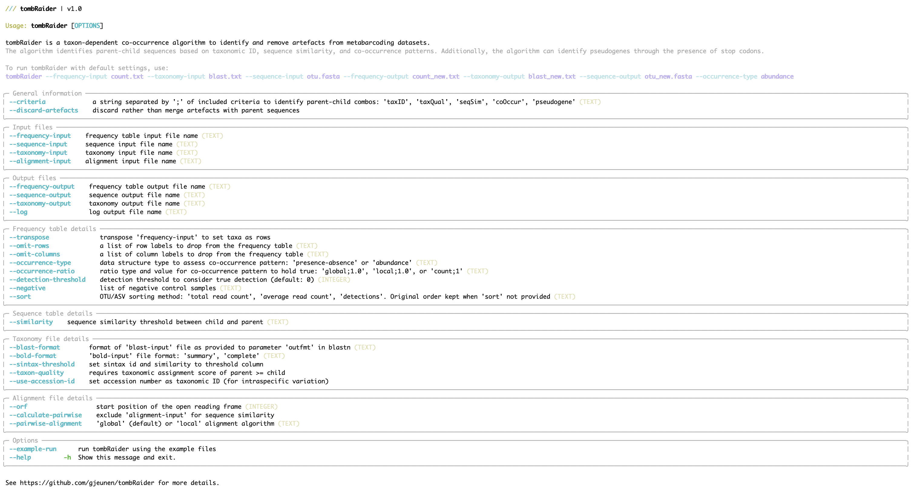

# *tombRaider* - an algorithm to identify artefacts from metabarcoding data

## 1. Introduction

Thank you for using *tombRaider*, an algorithm capable of identifying and removing artefact sequences from metabarcoding data sets.

## 2. Installation

*tombRaider* is a command-line only toolkit running on typical Unix/Linux environments and is exclusively written in Python3. *tombRaider* can be installed manually from GitHub. Below are details for the manual installation process (section 2.1 Manual installation). Due to the native implementation of the incorporated functions, only a limited number of dependencies restricted to non-built-in Python3 modules are required for *tombRaider* to successfully execute. A complete list of the dependencies can be found below (section 2.2 Dependencies). Remember to install the dependencies separately, since the GitHub installation of *tombRaider* will not install the dependencies for you!

### 2.1 Manual installation

To manually install *tombRaider*, download the files from GitHub using the `git clone` command in the Terminal.

```{code-block} bash
git clone https://github.com/gjeunen/tombRaider.git
```

Dependent on your OS settings, the downloaded files might need to be made executable, which can be achieved by running the `chmod +x tombRaider` command. You can make *tombRaider* globally accessible in your OS using the following command:

```{code-block} bash
export PATH="/path/to/tombRaider/folder:$PATH"
```

Substitute `/path/to/tombRaider/folder` with the actual path to the repo folder on your system. Adding this line to the `.bash_profile`, `.bashrc`, or `.zshrc` file in your home directory will keep *tombRaider* globally accessible, even when closing the Terminal application.

### 2.2 Dependencies

Once the GitHub files are downloaded, ensure the following Python3 modules with the correct or compatible versions are accessible to *tombRaider*:

1. [Python3](https://www.python.org/downloads/) (*v 3.11.5*)
2. [rich](https://rich.readthedocs.io/en/stable/introduction.html) (*v 13.3.5*)
3. [rich-click](https://github.com/ewels/rich-click) (*v 1.6.1*)
4. [numpy](https://numpy.org) (*v 1.25.2*)
5. [pandas](https://pandas.pydata.org/docs/getting_started/install.html) (*v 2.1.4*)

### 2.3 Check the installation

To check if the installation was successful, type the following command into the Terminal to prompt the help information:

```{code-block} bash
tombRaider -h
```



Additionally, you can run *tombRaider* on example files in the `exampleFiles` subdirectory by executing:

```{code-block} bash
tombRaider --example-run
```

## 3. Code execution

With *tombRaider* only a single line of code is required to identify and remove artefacts from your metabarcoding data!

To run *tombRaider* with default values, use the following line of code:

```{code-block} bash
tombRaider --method 'taxon-dependent co-occurrence' --frequency-input countTable.txt --sequence-input sequences.fasta --blast-input blastnResults.txt --frequency-output countTableNew.txt --sequence-output sequencesNew.fasta --blast-output blastnResultsNew.txt --condensed-log condensedLog.txt --detailed-log detailedLog.txt --count 0 --sort 'total read count'
```

Detailed information about all input file structures (section 4. Input files) and parameters (section 5. Parameters) can be found below.

## 4. Input and output files

An example of all input files can be found in the `exampleFiles` subdirectory on GitHub or where *tombRaider* is installed on your OS. This file list can help determine the file structures required by *tombRaider* when formatting errors are preventing a successful execution on your local files.

### 4.1 Count table

The count table, also known as frequency table, OTU table, or ASV table, should be a tab-delimited file whereby the taxa are represented in rows and samples in columns. The first row of the file is treated as the column headers (sample list), while the first column is treated as row names (sequence or OTU names). The count table can be read in through the `--frequency-input` parameter and is required for *tombRaider* to successfully execute. If your count table is oriented in the opposite orientation, i.e., samples as rows and taxa as columns, the `--taxa-are-rows` parameter should be set to `'False'`. If your count table is oriented in the correct direction, you can omit the `--taxa-are-rows` parameter, as it will default to `'True'`.

For *tombRaider* to execute successfully, the count table should not contain any metadata rows or columns. Frequently-occurring metadata columns in a count table could, for instance, be the taxonomic ID for a sequence or the actual sequence of the OTU. If any metadata columns or rows are present in your count table, you can provide the column header(s) and/or row name(s) using the `--omit-columns` and `--omit-rows` parameters, respectively. Multiple labels can be provided to the parameters using the `,` delimiter. Do not use spaces after the `,` delimiter!

Please note that columns and headers will be removed prior to transposing the table when `--taxa-are-rows` is set to `'False'`. So, if your count table is oriented whereby the taxa are columns and one of the rows contains the taxonomic ID with label "taxID" and another row contains the sequence with label "sequence", use the following line of code:

```{code-block} bash
tombRaider --frequency-input countTable.txt --taxa-are-rows False --omit-rows 'taxID,sequence' ...
```

An updated count table, whereby child sequences are merged with parent sequences, can be written to an output file using the `--frequency-output` parameter. If the `--frequency-output` parameter is not provided, the following warning message will be printed in bold yellow in the Terminal window by *tombRaider*:

```{note}
WARNING | --frequency-output not specified, not writing updated table to file...
```

### 4.2 Sequence list

The sequence file should be in the format of a .fasta file, either as a 2-line or multi line structure. The sequence file can be provided with the `--sequence-input` parameter and is required for *tombRaider* to successfully execute. An updated sequence file, whereby artefacts are removed, can be written to an output file using the `--sequence-output` paramter. If the `--sequence-output` parameter is not provided, the following warning message will be printed in bold yellow in the Terminal window by *tombRaider*:

```{note}
WARNING | --sequence-output not specified, not writing updated seq list to file...
```

### 4.3 Taxonomy assignment

*tombRaider* currently supports 4 taxonomy classification methods for optimal flexibility of a user's bioinformatic pipeline, including BLAST, BOLD, SINTAX, and IDTAXA. The taxonomy input file is essential when specifying the `taxon-dependent co-occurrence` and `taxon-dependent merging` options for the `--method` parameter (please find more info in section 5.1 Main function). When specifying `--method taxon-independent co-occurrence`, no taxonomy input file is needed for *tombRaider* to execute. However, a taxonomy input and output file can still be provided in this case, which will subset the taxonomy file and remove the artefacts in the specified output file. This functionality is included to ensure all documents are updated and allow for easy import in other software packages without errors, such as [phyloseq](https://joey711.github.io/phyloseq/).

Please find below more detailed information about each of the 4 taxonomy classification format requirements for *tombRaider*.

If you have any other taxonomy classification method you would like to see incorporated into *tombRaider*, please let us know and we'll include it in the next major update.

#### 4.3.1 BLAST

BLAST is the most commonly-used method for taxonomy assignment in eukaryote metabarcoding research and can be conducted online or via the command-line interface. *tombRaider* can read in BLAST results using the `--blast-input` parameter and output the updated BLAST results, with artefacts removed, using the `--blast-output` parameter. Currently, *tombRaider* only supports the tabular output format 6. This format can be retrieved from your BLAST search through the website by selecting the "Hit Table(text)" option for downloading. Please see the screenshot below for additional info.


When executing BLAST via the CLI, the following code will ensure the proper format is selected for *tombRaider*:

```{code-block} bash
blastn -query sequences.fasta -outfmt 6
```

The *tombRaider* algorithm requires the following fields to be present in the BLAST file:

- qaccver: query sequence id
- qcovs: query coverage
- pident: percent identity match
- saccver: subject accession version
- evalue: expected value
- length: alignment length
- gapopen: number of gap openings
- mismatch: number of mismatches

Use the `--blast-format` parameter to tell *tombRaider* where these fields are located within your BLAST file. The `--blast-format` parameter takes in the string provided to `blastn -outfmt` when you executed BLAST via the CLI. When downloading BLAST results from the website, this metadata is provided in the first few lines of the downloaded document (line starting with `#`). When running blastn via the CLI, we recommend using the following line of code to enable the default option for `--blast-format`:

```{code-block} bash
blastn -query sequences.fasta -outfmt '6 qaccver saccver ssciname staxid length pident mismatch qcovs evalue bitscore qstart qend sstart send gapopen' -max_target_seqs 100 -perc_identity 50 -qcov_hsp_perc 50 -out blastTaxonomy.txt
```

##### 4.3.1.1 Intra-specific variation

When the genetic marker holds information on intra-specific variation (haplotypes) and the aim of the study is to investigate this intra-specific variation within various species, the taxonomic ID used by *tombRaider* should be set to the subject accession version ('saccver'). To accomplish this, provide the `--use-accession-id` parameter. No arguments are necessary for this parameter. Please find an example line of code below:

```{code-block} bash
tombRaider --method 'taxon-dependent co-occurrence' --frequency-input countTable.txt --sequence-input sequences.fasta --blast-input blastnResults.txt --frequency-output countTableNew.txt --sequence-output sequencesNew.fasta --blast-output blastnResultsNew.txt --condensed-log condensedLog.txt --detailed-log detailedLog.txt --count 0 --sort 'total read count' --use-accession-id
```

Please note that this option to investigate intra-specific variation is only available for BLAST!

#### 4.3.2 BOLD

TBA

#### 4.3.3 SINTAX

The SINTAX algorithm predicts the taxonomy of marker gene reads based on k-mer similarity and is implemented in [USEARCH](https://www.drive5.com/usearch/) and [VSEARCH](https://github.com/torognes/vsearch). When the SINTAX classification algorithm was used for taxonomy assignment during the bioinformatic pipeline, the input file can be provided using the `--sintax-input` parameter. To write the updated list with artefacts removed, use the `--sintax-output` parameter. The SINTAX reports should be in tab-delimited format, which is the default format for [USEARCH](https://www.drive5.com/usearch/) and [VSEARCH](https://github.com/torognes/vsearch). *tombRaider* defaults to using the SINTAX results without a threshold applied, i.e., the second column in the SINTAX report. Use the `--sintax-threshold` parameter without arguments for *tombRaider* to use the SINTAX results where the user-defined threshold has been applied, i.e., the fourth column in the SINTAX report.

#### 4.3.4 IDTAXA

TBA

## 5. Parameters

Please find below the details about all parameters incorporated into *tombRaider*. Parameters associated with input and output files can be found in section 4. Input and output files.

### 5.1 Main algorithm

#### 5.1.1 --method

*tombRaider* currently supports 3 algorithms to identify artefact sequences in metabarcoding data sets, including one novel approach and two widely-used methods in the metabarcoding research community. The algorithms can be specified using the `--method` parameter. The following three options are currently supported:

1. `--method 'taxon-dependent co-occurrence'`: This novel approach is the default setting in *tombRaider* and allows for the most accurate species and haplotype recovery from metabarcoding data sets. Artefacts are identified based on taxonomic classification, sequence similarity, and co-occurrence patterns. For more information about the optional parameters, please see section 5.2 Parameters. This algorithm is currently the only automated method to recover haplotypes from metabarcoding data sets.
2. `--method 'taxon-independent co-occurrence'`: This approach identifies artefacts based on sequence similarity and co-occurrence patterns. It was pioneered by [Froslev et al., 2017](https://github.com/tobiasgf/lulu) and has since seen alteration and optimisation in a variety of settings, e.g., [mumu](https://github.com/frederic-mahe/mumu).
3. `--method 'taxon-dependent merging'`: This approach merges sequences based on taxonomic ID and is a widely-used approach in the metabarcoding research community.

### 5.2 Parameters

#### 5.2.1 --occurrence-type

The parameter `--occurrence-type` enables users to specify if the co-occurrence pattern between parent and child sequences should be based on read abundance (`--occurrence-type abundance`) or presence-absence (`--occurrence-type 'presence-absence'`), with the default set to `--occurrence-type abundance`.

When `--occurrence-type abundance` is selected, for the co-occurrence pattern to hold true, the parent will need to achieve a higher read abundance than the child. The user can specify a threshold for how frequently this statement can be violated before the co-occurrence pattern does not hold true anymore (please see [section 5.2.5 count, --global-ratio, --local-ratio](####-5.2.5-count,-global-ratio,-local-ratio)).

#### 5.2.2 --detection-threshold

#### 5.2.3 --similarity

#### 5.2.4 --negative

#### 5.2.5 count, --global-ratio, --local-ratio

#### 5.2.6 --sort

### 5.3 Options

#### 5.3.1 --example-run

#### 5.3.2 --help

Display *tombRaider*'s help information in the Terminal window.
